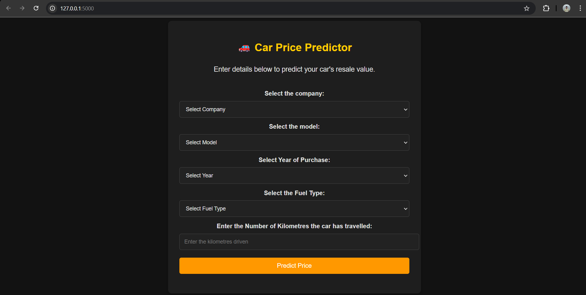

# 🚗 CarValuator

## Overview

Car Price Predictor is a web application that allows users to estimate the resale value of their car based on input parameters like company, model, purchase year, fuel type, and kilometers driven.

## Demo



## Features

- Select car company from dropdown.
- Select car model dynamically based on company selection.
- Choose year of purchase.
- Select fuel type.
- Enter kilometers driven.
- Get a predicted resale price for the car.

## Tech Stack

- **Backend**: Flask (Python)
- **Frontend**: HTML, CSS, JavaScript
- **Styling**: Bootstrap
- **Machine Learning Model**: Scikit-learn

## File Structure

```
├── application.py   # Flask backend
├── templates/
│   ├── index.html   # Frontend UI
├── static/css/
│   ├── style.css    # Stylesheet
│   ├── image.png    # Demo image
├── LinearRegressionModel.pkl        # Machine Learning model
├── predictor.ipynb
├── quikr_car.csv
├── Cleaned_Car_data.csv
└── README.md        # Project documentation
```

### Running the Project

1. Clone the repository:
   ```bash
   git clone https://github.com/KanhaiyaChhaparwal24/Car-Price-Predictor.git
   cd Car-Price-Predictor
   ```
2. Run the Flask application:
   ```bash
   python application.py
   ```
3. Open a web browser and go to:
   ```
   http://127.0.0.1:5000/
   ```

## Future Enhancements

- Add more car brands and models.
- Improve UI with better styling.
- Integrate real-time market price updates.

## Data Source:

- Data was scraped from <a href="https://quikr.com">Quikr</a> and <a href="https://www.kaggle.com/">Kaggle</a> websites.
- Data is available in the `quikr_car.csv` file.

## Contributors

- **Kanhaiya Chhaparwal** - Developer

## Help me Improve

<p> Hello readers, if you find any bugs, please consider raising issue so that I can address them asap and connect with me on
<a href="mailto:kanhaiyaac24@gmail.com">Email</a> or
<a href="https://www.linkedin.com/in/kanhaiya-chhaparwal/">Linkedin</a>
